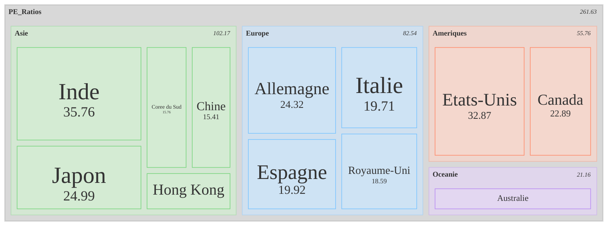

# Le Ratio Shiller PE : Comprendre et Utiliser

---

## Qu'est-ce que le Shiller PE ?
- Également appelé **CAPE Ratio** (*Cyclically Adjusted Price-to-Earnings*).  
- Développé par **Robert Shiller**, prix Nobel d'économie.  
Formule :  
```math
\text{Shiller} PE = \frac{\text{Prix de l'action}}{\text{Moyenne des bénéfices ajustés sur 10 ans}}
```
- Permet de lisser les fluctuations économiques et les pics.

---

## Pourquoi est-ce utile ?
- **Évaluation des marchés :** Identifier les bulles ou sous-évaluations.
- **Approche à long terme :** Moins volatile que le PE standard.
- **Indicateur historique :** Liens avec la performance future des marchés.

---

## Comment interpréter le Shiller PE ?
- **Valeurs élevées :** Marché surévalué (ex. : avant la bulle Internet).
- **Valeurs faibles :** Opportunités d'achat.
- Moyenne historique (S&P 500) : ~16-17.
- Exemple :
  - Crise de 1929 : Shiller PE élevé.
  - Crise de 2008 : Shiller PE en baisse.

---

## Limites du Shiller PE
1. **Contexte actuel :** Peut ne pas refléter les taux d'intérêt bas.
2. **Secteurs spécifiques :** Non adapté pour analyser certaines industries.
3. **Prédiction difficile :** Pas infaillible pour prévoir les krachs.

---

## En résumé
- **Outil puissant** pour les investisseurs à long terme.
- Identifier les opportunités **d'achat** ou **de vente** sur le marché.
- Doit être utilisé avec d'autres indicateurs pour une analyse complète.

---

### Ressources
- [Site officiel de Robert Shiller](http://www.econ.yale.edu/~shiller/)
- [Données historiques du Shiller PE](https://www.multpl.com/shiller-pe)

---

